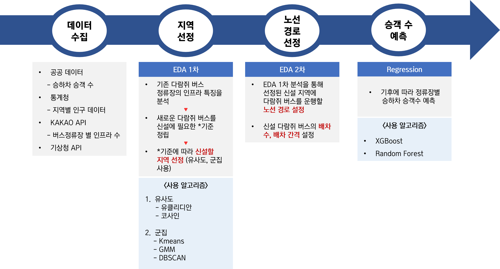

# 다람쥐 버스 분석 및 노선 신설 방안 제시
- ### 프로젝트 조: Multicampus Final project 3조
- ### 프로젝트 기간: 2023.06.20~2023.07.31
- ### 프로젝트 구성원 : 양충모, 김은비, 김지연, 서정식   
- ### 프로젝트 지원: 멀티캠퍼스
<br>

## 프로젝트 설명
> <center>현재 운행 중인 <u>다람쥐 버스</u>의 특성을 분석하여,</center>   
> <center>다람쥐 버스가 필요한 "새로운 지역을 선정"하고 "신설 노선의 경로를 설정"하는 프로젝트 입니다.</center>  


- 다람쥐 버스란?  
  - 출퇴근시간에 특정구간을 반복 운행하는 버스
  - 버스의 승객 수송량을 보조해주고 교통체증을 완화해주기 위한 서비스   
<br>


- 프로젝트 배경 : 하기의 이유들로 기존 지역 이외에도 다람쥐 버스의 새로운 노선 신설 필요       
  - 출근 시간대 대중교통 혼잡도 감소 필요
  - 기존 다람쥐 버스 도입 후 높은 수요 & 도입 효과를 낳음
  - 다람쥐 버스 노선의 신설에 대한 긍정적인 여론

 <br>

## 프로젝트 흐름도      
  
1. 분석에 필요한 데이터 수집.  
2. EDA 1차 목표: 다람쥐 버스를 신설할 지역 선정
3. EDA 2차 목표: 
   - 선정된 지역에서 다람쥐 버스를 운행할 노선 경로 선정
   - 신설 노선의 배차 수, 배차 간경 설정
4.  회귀분석으로 기후의 변화에 따라 선정된 노선의 정류장 별 승하차 승객 수 예측
<br>

<!-- - 데이터 수집  
  다람쥐 버스 정류장의 시간별 승하차 승객수를 수집한다.       
- 기존 다람쥐 버스 분석     
  기존 다람쥐 버스 정류장의 인프라 특징이 어떤지 분석한다.      
- 다람쥐 버스 신설 지역 선정 
  분석한 내용을 토대로 다람쥐 버스가 필요한 지역을 선정한다.   
- 다람쥐 버스 노선 경로 설정    
  분석한 내용을 토대로 다람쥐 버스의 경로를 설정한다.
- 다람쥐 버스 배차 수와 배차 간격 설정      
  다람쥐 버스가 효율적으로 운행할 수 있도록 배차 수와 배차 간격을 설정한다.   -->

<!-- ## 데이터 출처 
- 공공데이터 
- 통계청 
- KAKAO API  -->


 ## Environment
 python, jupyter notebook, ubuntu, spark
<br>

## Git Hub Commit 
```
- feat: 새로운 기능에 대한 커밋
- fix: 수정에 대한 커밋
- chore: 그 외 자잘한 수정에 대한 커밋(기타 변경)
- docs: 문서 수정에 대한 커밋
- style: 코드 스타일 혹은 포맷 등에 관한 커밋
- refactor: 코드 리팩토링에 대한 커밋
```
<br>


## 모듈 & 노트북 설명 
  #### Data

  - [Extract.py](https://github.com/Mulcam-Finalproject3/Resurrection_Of_Squirrel_Bus/blob/fa563f0241962d8eb74a49d7627080da30d6bca3/src/Data/Extract.py): 데이터 수집
  - [preprocessing.py](https://github.com/Mulcam-Finalproject3/Resurrection_Of_Squirrel_Bus/blob/fa563f0241962d8eb74a49d7627080da30d6bca3/src/Data/preprocessing.py): 수집된 통계, 인프라, 버스 데이터를 전처리하여 1차 분석에 필요한 데이터 프레임 반환
  - [bus_preprocessing.py](https://github.com/Mulcam-Finalproject3/Resurrection_Of_Squirrel_Bus/blob/fa563f0241962d8eb74a49d7627080da30d6bca3/src/Data/bus_preprocessing.py) : 공공데이터에서 수집한 버스 데이터 전처리
  - [preprocessing_regression.py](https://github.com/Mulcam-Finalproject3/Resurrection_Of_Squirrel_Bus/blob/fa563f0241962d8eb74a49d7627080da30d6bca3/src/Data/preprocessing_regression.py): 회귀 데이터의 전처리
- [PCA_Preprocessing.py]([src/Data/PCA_Preprocessing.ipynb](https://github.com/Mulcam-Finalproject3/Resurrection_Of_Squirrel_Bus/blob/fa563f0241962d8eb74a49d7627080da30d6bca3/src/Data/PCA_Preprocessing.ipynb))
#### EDA
- [EDA_STEP_1.py](https://github.com/Mulcam-Finalproject3/Resurrection_Of_Squirrel_Bus/blob/4fd26975cc1d171144e10818462ceb6fee42f912/src/EDA/EDA_STEP_1.py): 기-종점 거리 구하기
- [folium.py](https://github.com/Mulcam-Finalproject3/Resurrection_Of_Squirrel_Bus/blob/4fd26975cc1d171144e10818462ceb6fee42f912/src/EDA/folium.py): 폴리엄 
- [visualization.py](https://github.com/Mulcam-Finalproject3/Resurrection_Of_Squirrel_Bus/blob/4fd26975cc1d171144e10818462ceb6fee42f912/src/EDA/visualization.py): EDA 그래프 시각화
- [zeppelin.ipynb]()
#### Modeling
- [similarity.py](https://github.com/Mulcam-Finalproject3/Resurrection_Of_Squirrel_Bus/blob/4fd26975cc1d171144e10818462ceb6fee42f912/src/Modeling/similarity.py): EDA 1차에 사용된 유사도 알고리즘(유클리디안, 코사인) 
- [clustering.py](https://github.com/Mulcam-Finalproject3/Resurrection_Of_Squirrel_Bus/blob/4fd26975cc1d171144e10818462ceb6fee42f912/src/Modeling/clustering.py): EDA 1차에 사용된 군집 알고리즘(KMeans, GMM, DBSCAN)
- [regression.py](https://github.com/Mulcam-Finalproject3/Resurrection_Of_Squirrel_Bus/blob/4fd26975cc1d171144e10818462ceb6fee42f912/src/Modeling/regression.py): 회귀 알고리즘(XGBoost, Random Forest)

---- 여기 아래 수정----🌟
#### [01_preprocessing.ipynb](https://github.com/Mulcam-Finalproject3/Resurrection_Of_Squirrel_Bus/blob/7d9773f29868a925b71645c0db4d7f18a7de4477/src/01_preprocessing.ipynb) : 데이터 전처리 과정
#### [02_EDA1.ipynb](https://github.com/Mulcam-Finalproject3/Resurrection_Of_Squirrel_Bus/blob/7d9773f29868a925b71645c0db4d7f18a7de4477/src/02_EDA1.ipynb) : 다람쥐 버스 신설 지역 선정 과정
#### [03_EDA2_기존경유지분석.ipynb](https://github.com/Mulcam-Finalproject3/Resurrection_Of_Squirrel_Bus/blob/7d9773f29868a925b71645c0db4d7f18a7de4477/src/03_EDA2_%EA%B8%B0%EC%A1%B4%EA%B2%BD%EC%9C%A0%EC%A7%80%EB%B6%84%EC%84%9D.ipynb) :  노선 경로 선정 과정
#### [regression.ipynb](https://github.com/Mulcam-Finalproject3/Resurrection_Of_Squirrel_Bus/blob/7d9773f29868a925b71645c0db4d7f18a7de4477/src/04_regression.ipynb) : 기후 변화에 따른 승차 인원 수 예
